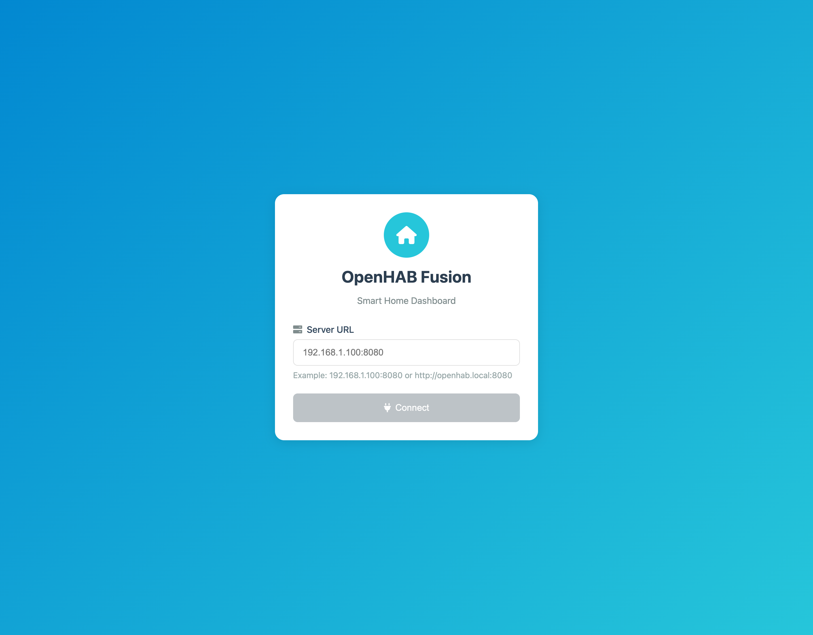
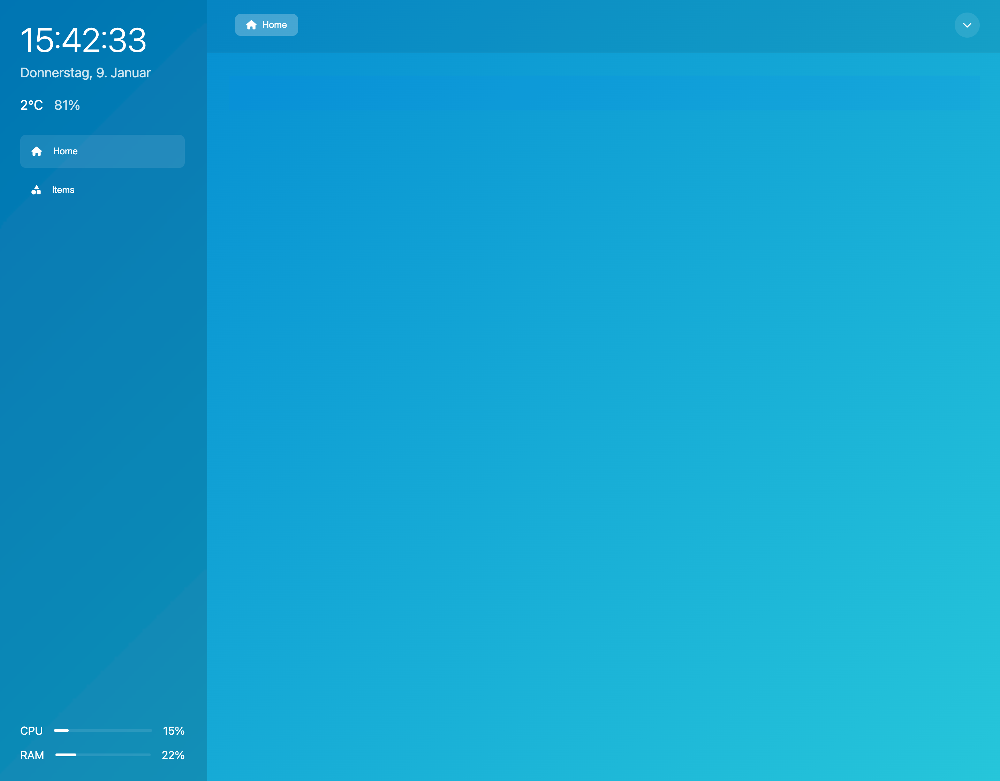
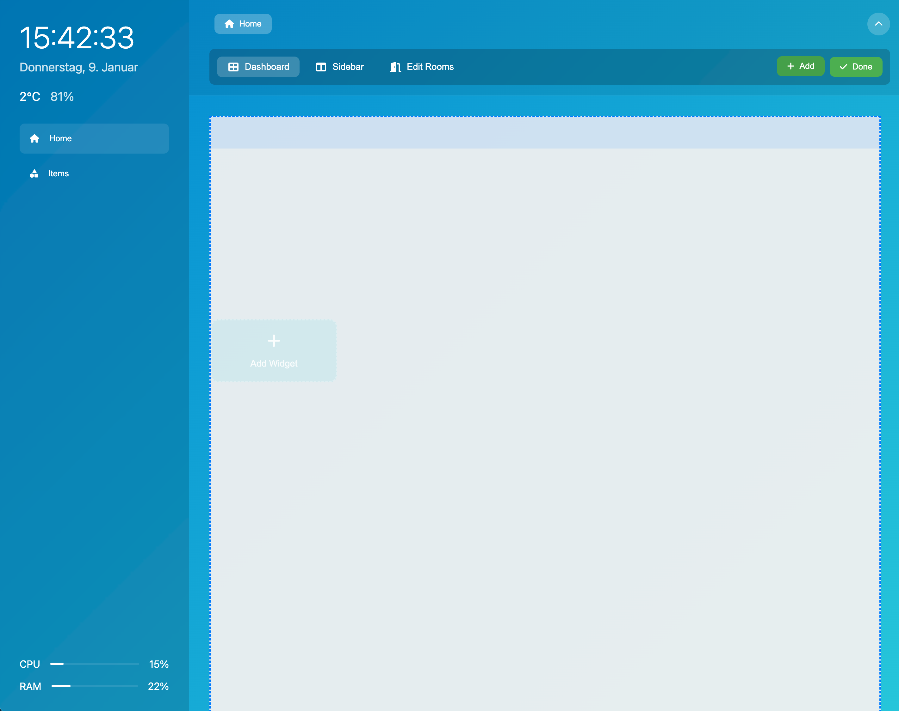
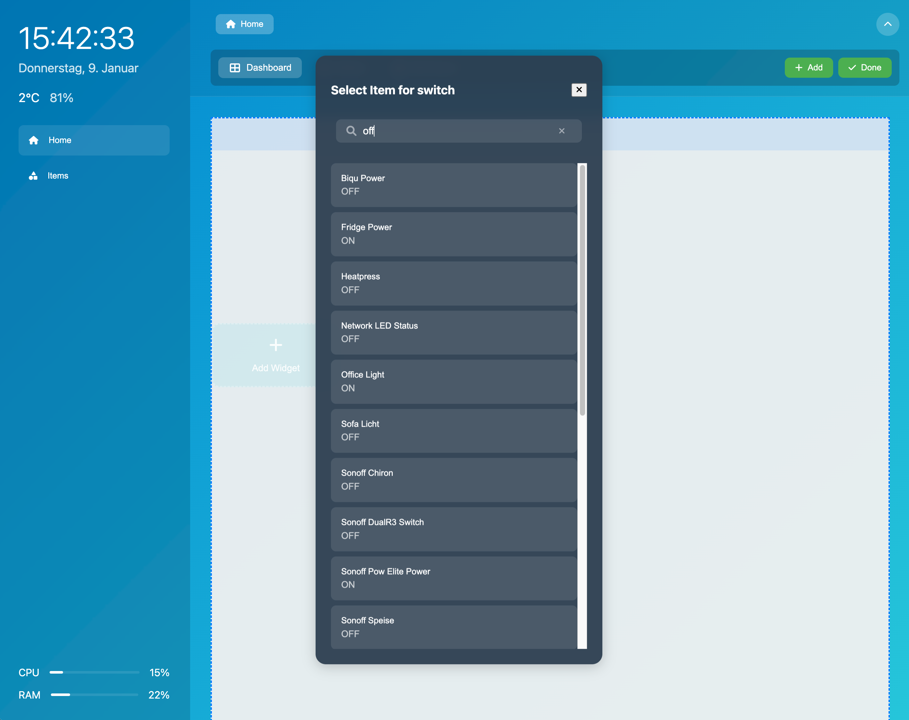
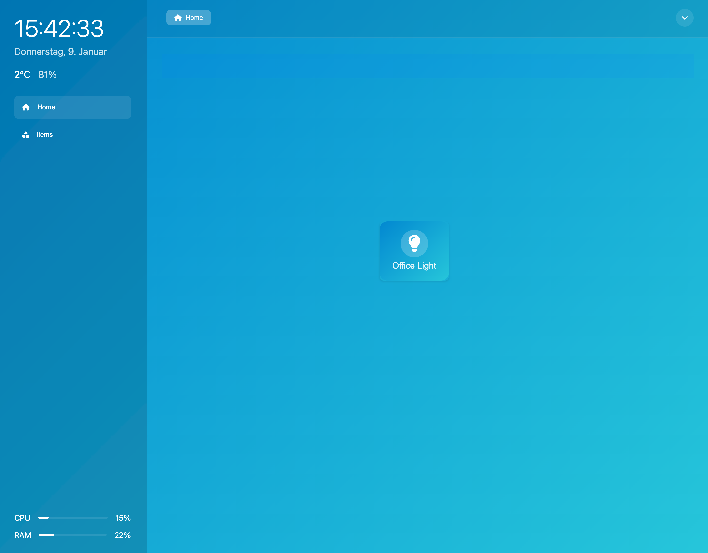

# OpenHAB Fusion

A modern, customizable dashboard for OpenHAB 3+. Built with Svelte and designed to provide a seamless smart home control experience.

## ✨ Features

- 🎨 Modern, clean interface
- 📱 Responsive design for all devices
- 🎯 Drag & drop dashboard customization
- 🎮 Multiple widget variants
- 🔧 Easy configuration
- 🏃‍♂️ Fast and lightweight
- 🔒 Direct OpenHAB connection (no additional server needed)

## 🖼️ Screenshots

### Connect to OpenHAB

Secure and simple connection to your OpenHAB instance.

### Dashboard Overview

Clean and intuitive dashboard interface with customizable widgets.

### Edit Mode

Powerful edit mode with drag & drop functionality and grid layout.

### Item Selection

Easy item selection with smart filtering and search.

### Dashboard with Widgets

Beautiful widgets for all your smart home controls.

## 🚀 Getting Started

### Quick Start
1. Download the latest release
2. Extract the files to your web server
3. docker compose up --build
4. Open the web interface on http://localhost:5050
5. Connect to your OpenHAB instance
6. Start customizing your dashboard!

## 🧩 Widgets

OpenHAB Fusion comes with a variety of pre-built widgets:

- **Switches**: Toggle lights and devices
- **Dimmers**: Control brightness levels
- **Sensors**: Display temperature, humidity, etc.
- **RGB Lights**: Full color control
- **Thermostats**: Climate control
- **Charts**: Data visualization
- And more!

## 🛠️ Technology Stack

- [Svelte](https://svelte.dev/) - Frontend framework
- [TypeScript](https://www.typescriptlang.org/) - Type safety
- [Vite](https://vitejs.dev/) - Build tool
- [OpenHAB REST API](https://www.openhab.org/docs/configuration/restdocs.html) - Backend integration

## 📝 License

This project is licensed under the MIT License - see the [LICENSE](LICENSE) file for details.

## 🤝 Contributing

Contributions are welcome! Please feel free to submit a Pull Request.

1. Fork the repository
2. Create your feature branch (`git checkout -b feature/AmazingFeature`)
3. Commit your changes (`git commit -m 'Add some AmazingFeature'`)
4. Push to the branch (`git push origin feature/AmazingFeature`)
5. Open a Pull Request

## 💖 Support

If you like this project, please consider:
- Starring the repository ⭐
- Sharing it with others 🔄
- Contributing to the code 👨‍💻

## 📧 Contact

Your Name - [@yourusername](https://twitter.com/yourusername)

Project Link: [https://github.com/yourusername/openhab-fusion](https://github.com/yourusername/openhab-fusion)